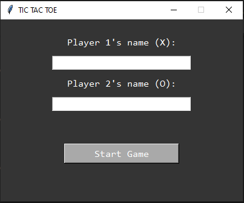

# 📜 Author
# 👨‍💻 James Furaque
# 🎮 Tic Tac Toe Game

## 📝 Description
This is a simple **Tic Tac Toe** game built using **Python** and **Tkinter**. The game provides an intuitive graphical interface where two players can compete by taking turns.

The game consists of two main windows:
1. **First Window (main.py)** – Players enter their names before starting the game.
2. **Main Game (tictactoe.py)** – The actual Tic Tac Toe game board where players take turns.

---

## How to Play
1. **Enter Player Names**  
   - The first window prompts users to enter their names.
   - Player 1 is automatically assigned **"X"** and will start the game.
   - Player 2 is assigned **"O"**.

2. **Gameplay Mechanics**
   - Players take turns placing their mark (**X or O**) on the board.
   - A player **wins** by aligning **three marks in a row**, either:
     - **Horizontally**
     - **Vertically**
     - **Diagonally**
   - If the board fills up without a winner, the game ends in a **Tie**.

3. **Restarting the Game**
   - The game has a **Restart Button**, allowing players to start a new round.

---

## Tools & Techniques Used
### **Language**
- **Python**

### **Frameworks & Libraries**
- **Tkinter** (for GUI)
- **Subprocess** (for launching `tictactoe.py` from `main.py`)

### **Game Features**
- **Graphical Interface** using `Tkinter`
- **Player Input Validation**
- **Game Logic for Winner Detection**
- **Restart Functionality**
- **Window Positioning** to always open in the center

---

## Screenshots
### Starting Window
- 

### Main Game Window
- 

---
## How to Run the Game
### **1️. Run the First Window (main.py)**
- Enter Player 1's Name and Player 2's Name.
- Click **"Start Game"** to proceed to the main game window.

### **2. Play Tic Tac Toe (tictactoe.py)**
- A new window will open with the Tic Tac Toe Board.
- Player 1 (X) starts first.
- Take turns until a winner is declared or the game ends in a tie.
- Click Restart to play again.
- Easily close the window when done playing.

---
## Future Improvements
- Sound effects for button clicks
- AI opponent (single-player mode)
- Score tracking
